# 🌾 Farm-IQ: AI-Powered Smart Farming Assistant

<div align="center">


[](https://python.org)
[](https://flask.palletsprojects.com)
[]()
[]()

*Revolutionizing agriculture through AI-powered crop recommendations, fertilizer suggestions, and disease detection*

[🚀 Live Demo](#) • [📖 Documentation](SETUP_GUIDE.md) • [📡 API Docs](API_DOCUMENTATION.md) • [🤝 Contribute](CONTRIBUTING.md) • [📞 Contact](#contact-)

</div>

---

## 🎯 Project Overview

Farm-IQ is an intelligent farming assistant that leverages Machine Learning and Deep Learning to provide farmers with data-driven insights for optimal agricultural decisions. Our platform offers three core AI-powered features designed to maximize crop yield and minimize losses.

### ⚡ Key Features

<table>
<tr>
<td align="center" width="33%">

### 🌱 Crop Recommendation
*Smart crop selection based on soil conditions*

**Input:** Soil nutrients (N-P-K), location data  
**Output:** Optimal crop recommendations  
**Accuracy:** 99.2%  

</td>
<td align="center" width="33%">

### 🧪 Fertilizer Analysis
*Precise nutrient management system*

**Input:** Soil composition, target crop  
**Output:** Customized fertilizer recommendations  
**Benefits:** Reduced costs, improved yield  

</td>
<td align="center" width="33%">

### 🔍 Disease Detection
*AI-powered plant health diagnosis*

**Input:** Plant leaf images  
**Output:** Disease identification & treatment  
**Coverage:** 14+ crop varieties  

</td>
</tr>
</table>

---

## ⚠️ Important Disclaimer

> **This is a Proof of Concept (POC) project.** The recommendations provided are for educational and demonstration purposes only. Do not make critical farming decisions based solely on this tool. Always consult with agricultural experts and conduct proper soil testing before making farming decisions.

---

## 🎯 Motivation & Impact

```mermaid
graph TD
    A[🌍 Global Agriculture Challenges] --> B[Traditional Farming Methods]
    A --> C[🤖 AI-Powered Solutions]
    
    B --> D[❌ Low Yield]
    B --> E[❌ Resource Waste]
    B --> F[❌ Disease Losses]
    
    C --> G[✅ Optimized Crop Selection]
    C --> H[✅ Efficient Resource Use]
    C --> I[✅ Early Disease Detection]
    
    G --> J[🎯 Farm-IQ Solutions]
    H --> J
    I --> J
    
    J --> K[📈 Increased Productivity]
    J --> L[💰 Reduced Costs]
    J --> M[🌱 Sustainable Farming]
```

<div align="center">



</div>

### 🌟 Why Farm-IQ?

- **🇮🇳 Agriculture-Dependent Economy:** In countries like India, 60%+ population depends on agriculture
- **📊 Data-Driven Decisions:** Transform traditional farming with ML/DL insights
- **🎯 Precision Agriculture:** Optimize resource utilization and maximize yield
- **🔬 Technology Integration:** Bridge the gap between modern AI and traditional farming

---

## 📊 Datasets & Data Sources

<div align="center">

| Dataset Type | Source | Records | Accuracy |
|-------------|--------|---------|----------|
| **Crop Recommendation** | [Kaggle Dataset](https://www.kaggle.com/atharvaingle/crop-recommendation-dataset) | 2,200+ | 99.2% |
| **Fertilizer Suggestions** | [Custom Dataset](https://github.com/vannu07/Farm-IQ-AI-Powered-Smart-Farming-Assistant/blob/main/app/Data/fertilizer.csv) | 1,000+ | 95.8% |
| **Disease Detection** | [Plant Disease Dataset](https://www.kaggle.com/vipoooool/new-plant-diseases-dataset) | 87,000+ | 96.5% |

</div>

### 📓 Interactive Notebooks

Explore our research and model development:

- 🌾 **[Crop Recommendation Analysis](https://www.kaggle.com/atharvaingle/what-crop-to-grow)** - Comprehensive EDA and model comparison
- 🔬 **[Disease Detection with ResNet](https://www.kaggle.com/atharvaingle/plant-disease-classification-resnet-99-2)** - Advanced CNN implementation

---

## 🛠️ Technology Stack

<div align="center">

### Frontend Technologies


### Backend & ML/DL


### Data Science & Visualization


### Deployment & Version Control


</div>

---

## 💻 How to Use

### 🌱 Crop Recommendation System

**Step-by-Step Process:**

1. **Input Soil Data:** Enter N-P-K values (Nitrogen-Phosphorus-Potassium ratios)
2. **Location Details:** Provide state and city information
3. **Weather Integration:** System fetches real-time humidity and temperature
4. **AI Analysis:** ML model processes all parameters
5. **Recommendation:** Get optimal crop suggestions with confidence scores

> **💡 Pro Tip:** N-P-K values should be entered as ratios. Refer to [this guide](https://www.gardeningknowhow.com/garden-how-to/soil-fertilizers/fertilizer-numbers-npk.htm) for accurate measurements.

### 🧪 Fertilizer Recommendation System

**Intelligent Nutrient Analysis:**


### 🔍 Disease Detection System

**Advanced Computer Vision Pipeline:**

1. **Image Upload:** High-resolution leaf images (JPG/PNG)
2. **Preprocessing:** Image enhancement and normalization
3. **CNN Analysis:** ResNet-based disease classification
4. **Results:** Disease identification, severity assessment, treatment recommendations

#### 🌿 Supported Crops

<details>
<summary><strong>Click to view all 14 supported crops</strong></summary>

<div align="center">

| Fruits | Vegetables | Grains & Others |
|--------|------------|----------------|
| 🍎 Apple | 🌶️ Pepper | 🌽 Corn |
| 🫐 Blueberry | 🥔 Potato | 🌿 Soybean |
| 🍒 Cherry | 🍅 Tomato | 🥒 Squash |
| 🍑 Peach | 🫑 Bell Pepper | |
| 🍊 Orange | | |
| 🍇 Grape | | |
| 🍓 Strawberry | | |
| 🍇 Raspberry | | |

</div>

</details>

---

## 🚀 Local Installation Guide

### 📖 Quick Links

- **[Complete Setup Guide](SETUP_GUIDE.md)** - Detailed installation instructions
- **[API Documentation](API_DOCUMENTATION.md)** - Comprehensive API reference
- **[Contributing Guide](CONTRIBUTING.md)** - How to contribute to the project

### Prerequisites

<div align="center">

[](https://git-scm.com/download)
[](https://www.anaconda.com/)

</div>

### 📥 Installation Steps

1. **Clone the Repository**
   ```bash
   # For deployment-ready code
   git clone -b deploy https://github.com/vannu07/Farm-IQ-AI-Powered-Smart-Farming-Assistant.git
   cd Farm-IQ-AI-Powered-Smart-Farming-Assistant
   ```

2. **Environment Setup**
   ```bash
   # Create virtual environment
   conda create -n Farm-IQ python=3.6.12
   conda activate Farm-IQ
   
   # Install dependencies
   pip install -r requirements.txt
   ```

3. **Launch Application**
   ```bash
   python app.py
   ```

4. **Access the Platform**
   - Open your browser and navigate to the localhost URL displayed in terminal
   - Start exploring the AI-powered farming features!

### 🌿 Branch Information

- **`main` branch:** Complete development code with training notebooks
- **`deploy` branch:** Production-ready streamlined code (recommended for local setup)

---

## 🤝 Contributing

We welcome contributions from the agricultural and AI community! 

### 🔄 Contribution Workflow

1. **Fork** the repository
2. **Create** a feature branch (`git checkout -b feature/AmazingFeature`)
3. **Commit** your changes (`git commit -m 'Add AmazingFeature'`)
4. **Push** to the branch (`git push origin feature/AmazingFeature`)
5. **Open** a Pull Request

Please read our [CONTRIBUTING.md](https://github.com/vannu07/Farm-IQ-AI-Powered-Smart-Farming-Assistant/blob/main/Contributing.md) for detailed guidelines.

---

## 📈 Future Roadmap

<div align="center">


</div>

### 🎯 Upcoming Features

| Feature | Priority | Status | Expected Release |
|---------|----------|--------|------------------|
| 🎨 **Modern UI/UX** | High | 🔄 In Progress | Q2 2024 |
| 🌍 **Regional Data** | High | 📋 Planned | Q2 2024 |
| 🤖 **AI Chatbot** | Medium | 📋 Planned | Q3 2024 |
| 📊 **Analytics Dashboard** | Medium | 📋 Planned | Q4 2024 |
| 📱 **Mobile App** | Low | 💭 Concept | 2025 |

---

## ⚙️ Usage & License

### 📝 Academic & Research Use

This project is available for:
- ✅ Educational purposes
- ✅ Research and development
- ✅ Non-commercial applications
- ✅ Open source contributions

**Attribution Required:** Please cite this repository in your work and include the original source link.

### 📄 License

This project is licensed under the [GNU General Public License v3.0](https://github.com/vannu07/Farm-IQ-AI-Powered-Smart-Farming-Assistant/blob/main/LICENSE).

---

## 🙏 Acknowledgments

### 🌟 Special Thanks

This project builds upon the excellent foundation provided by:
- **[7NNS7's Farming Recommendation System](https://github.com/7NNS7/Recommendation-System-for-Farming)** - Core inspiration for crop and fertilizer recommendation modules
- **Kaggle Community** - For providing high-quality agricultural datasets
- **Open Source Community** - For the amazing ML/DL libraries and frameworks

> 💡 **Note:** Please star the original repositories that inspired this work!

---

## 📞 Contact & Support

<div align="center">

### 🤝 Get in Touch

[](https://www.linkedin.com/in/varnit-kumar-0883bb251/)
[](mailto:your-email@example.com)
[](https://github.com/vannu07)

</div>

### 💬 Support Options

- 🐛 **Bug Reports:** [Create an Issue](https://github.com/vannu07/Farm-IQ-AI-Powered-Smart-Farming-Assistant/issues)
- 💡 **Feature Requests:** [Discussion Forum](https://github.com/vannu07/Farm-IQ-AI-Powered-Smart-Farming-Assistant/discussions)
- 📧 **Direct Contact:** LinkedIn or Email for collaboration opportunities

---

<div align="center">

### 🌱 Made with ❤️ by Varnit Kumar

**Farm-IQ** • *Empowering Farmers with AI* • **2025**

[](https://github.com/vannu07/Farm-IQ-AI-Powered-Smart-Farming-Assistant/stargazers)
[](https://github.com/vannu07/Farm-IQ-AI-Powered-Smart-Farming-Assistant/network)
[](https://github.com/vannu07/Farm-IQ-AI-Powered-Smart-Farming-Assistant/watchers)

</div>
